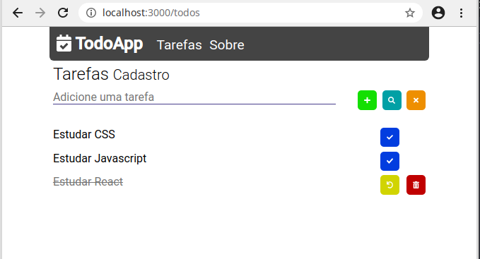

## Aplicativo de Tarefas

O app está dividido em duas partes backend e frontend sendo:

- O backend criado utilizando o node-restful para gerar as rotas e o mongoose para gerenciar a comunicação com o banco de dados mongodb.

- O frontend utilizando react, o front foi gerado por meio do comando:
npx [create-react-app](https://github.com/facebook/create-react-app)
 Como o intuito desse repositório é para estudo dos conceitos básicos do React (componentização, propriedades e estado) não foi utilizando Redux para fazer o gerenciamento de estado.

### Fazendo o download do projeto

Abaixo descrevo os passos necessários para baixar e configurar o projeto:

1. Fazer o download pelo github ou executar o comando abaixo no terminal:
`git clone https://github.com/leoncoutinho1/toDoList.git`

2. Acessar via terminal o caminho onde o projeto foi baixado e acessar a pasta backend:
`cd backend`

3. Instalar as dependências do backend da aplicação com:
`npm i`

4. Acessar o arquivo backend/.env.example e preencher a variável de ambiente MONGO_URL com sua url do MongoDB. Se ainda nao possuir uma pode ser criada no caminho `https://account.mongodb.com/account/login?nds=true`. Depois de configurado renomear o arquivo .env.example para '.env'.

5. Iniciar o servidor da aplicação com o comando `npm run dev` no terminal.

6. Ainda no terminal, sair da pasta backend e acessar a pasta frontend pelo comando:
`cd ../frontend`

7. Instalar as dependências do frontend:
`npm i`

8. Iniciar o frontend da aplicação com o comando `npm start`.

9. O servidor da aplicação roda na porta 3003 mas isso pode ser alterado no arquivo backend/src/config/server.js.

10. Ao iniciar o frontend o react se encarrega de abrir o navegador padrão e apresentar a aplicação. Caso isso não aconteça o app pode ser visualizado em `http://localhost:3000/`.

## Author

* **Leonardo Coutinho** - [@leoncoutinho1](https://github.com/leoncoutinho1/)
